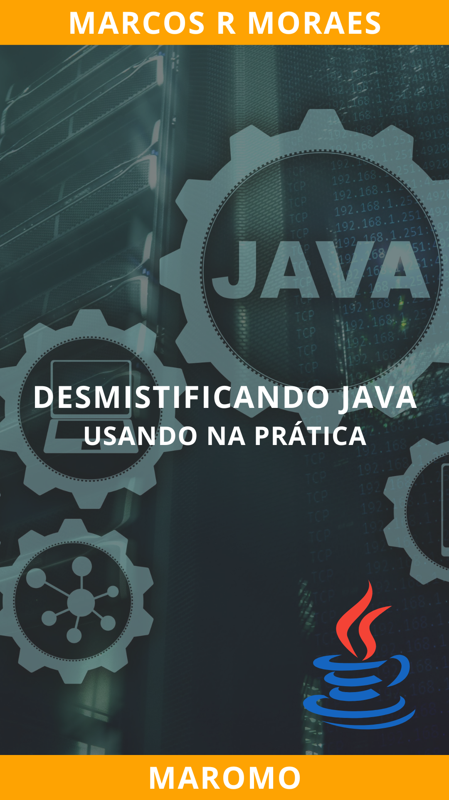

<h1 align="center"> Desmistificando Java: Usando na Prática</h1>

  

Bem-vindo ao repositório oficial do livro "Desmistificando Java: Usando na Prática", escrito pelo Prof. Marcos Roberto de Moraes, também conhecido como Maromo. Este repositório contém todos os códigos de exemplos e exercícios propostos no livro, organizados por capítulos para facilitar o acesso e a aprendizagem.

## Estrutura do Repositório
Cada diretório neste repositório corresponde a um capítulo do livro:

### Capítulos

* Capítulo 01: ☕ - Fundamentos Java, instalação e configuração.
* Capítulo 02: 💻 - Sintaxe Básica de Java
* Capítulo 03: 🧱 - Estrutura de um Programa Java
* Capítulo 04: 🧩 - Conceitos Avançados de POO em Java
* Capítulo 05: 🌐 - Programação Funcional e Lambda Expressions em Java
* Capítulo 06: ⚙️ - Concorrência e Manipulação de Exceções em Java
* Capítulo 07: 🗂️ - Coleções em Java
* Capítulo 08: 🎨 - Interfaces em Java
* Capítulo 09: 🧠 - Conceitos Avançados
* Capítulo 10: 👍 - Boas Práticas de Programação
* Capítulo 11: 🚀 - Projetos Práticos
* Capítulo 12: 🏁 - Concluindo uma etapa
* Capítulo 13: 🌍 - Capítulo Final: Referências e Recursos Adicionais

### Instruções
Em cada diretório relacionado aos tópicos do livro, você descobrirá códigos de exemplo e exercícios minuciosamente elaborados e extensivamente comentados, prontos para uma imersão profunda e enriquecedora. Para assegurar uma experiência de aprendizado completa e sem obstáculos, todas as informações adicionais que considerei cruciais foram inseridas no arquivo Readme.md de cada capítulo. Recomendo enfaticamente que, antes de se dedicar à resolução dos exercícios, reserve um momento para consultar o arquivo Leia-me (Readme.md) do capítulo correspondente. Essa prática irá enriquecer seu entendimento e prepará-lo adequadamente para as atividades propostas.

## Como Usar
Clone o Repositório:

Use o comando git clone https://github.com/maromo71 para clonar o repositório e ter acesso local a todos os arquivos.
Explore os Diretórios:

Navegue pelos diretórios correspondentes aos capítulos do livro e explore os códigos de exemplos e exercícios.
Execute e Modifique os Códigos:

Experimente executar os códigos em seu ambiente de desenvolvimento Java.
Sinta-se à vontade para modificar e brincar com os códigos para entender melhor os conceitos.
## Contribuições
Contribuições para este repositório são bem-vindas. **Se você tem ideias ou correções** que enriquecem o material, não hesite em fazer um **pull request**. Sua participação é valiosa para nós!

## Sobre o Autor
Prof. Marcos Roberto de Moraes, apelidado carinhosamente de Maromo, é um experiente educador e entusiasta de Java. Com anos de experiência no ensino de programação, Maromo dedicou-se a criar este recurso valioso para ajudar alunos e leitores a dominar Java de maneira prática e eficaz.

## Suporte
Se você tiver dúvidas ou precisar de ajuda com os códigos deste repositório, sinta-se à vontade para abrir uma issue aqui no GitHub.

## Mantenha-se Conectado
Para mais informações e recursos, siga o Prof. Maromo nas redes sociais e fique atento às atualizações.
